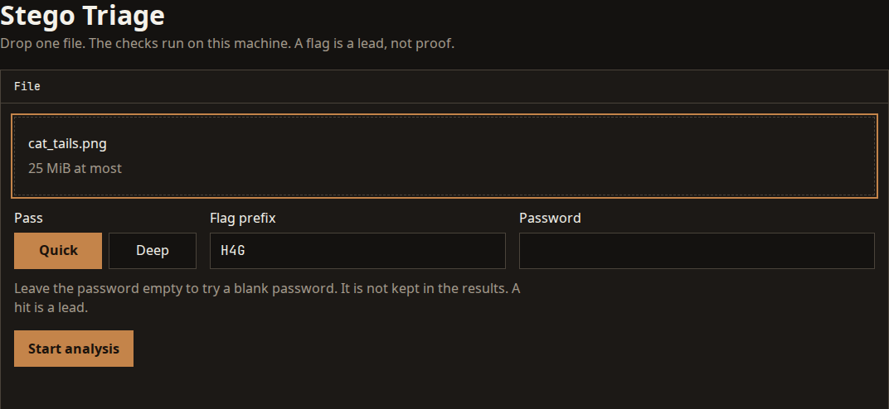
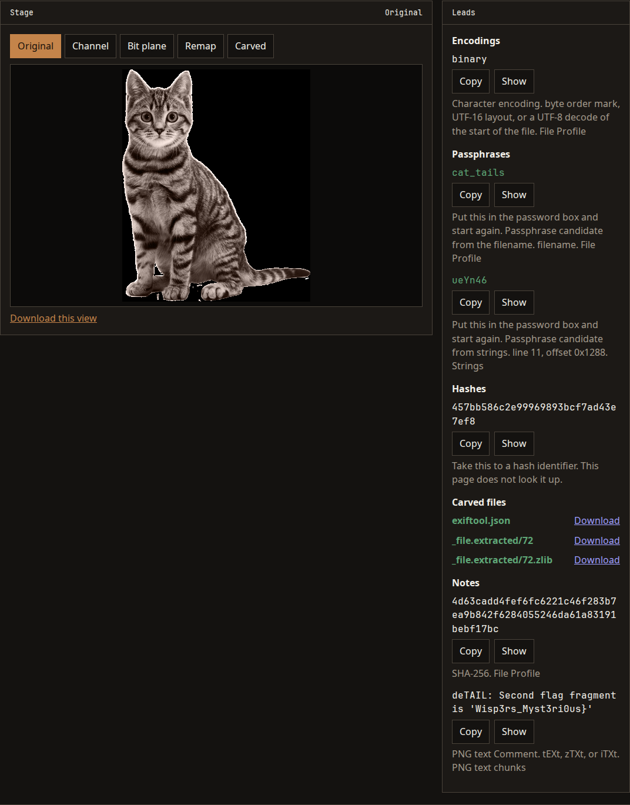
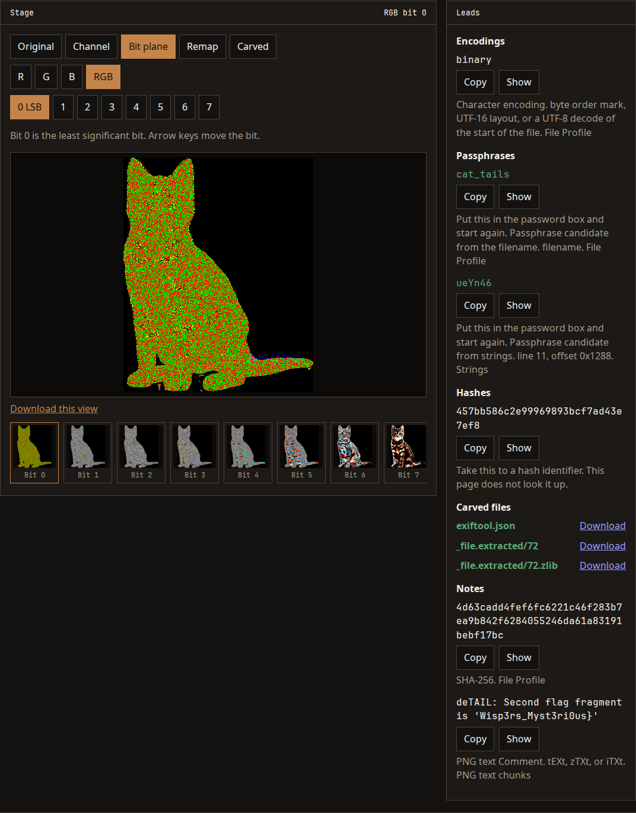
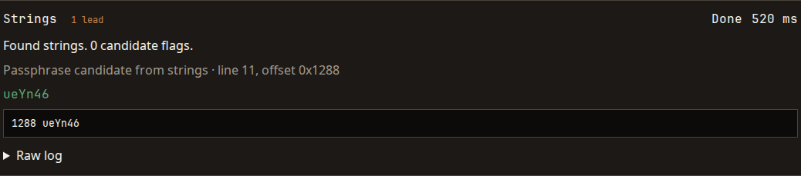

# Stego Triage

A local steganography workbench. Drop one file, read the leads, and step through bit planes on this machine.

The service has no accounts, no database, and no outbound calls. Uploads stay in a job directory and are deleted with the job, or after three hours. It listens on 127.0.0.1 only. Publishing this repository does not publish the service.



## Run

Clone the repository. The tools are not in git. Install them with Docker, or on Debian, Ubuntu, and Linux Mint with `./install-local.sh`.

### Docker

The image installs the tools. The process is not root, the container filesystem is read-only, and the network cannot open outbound connections.

```bash
docker compose build
./start.sh
```

Open http://127.0.0.1:8786/. `./stop.sh` stops the container.

To move an image to a machine that is offline:

```bash
./export-image.sh
# on the other machine
./import-image.sh
./start.sh
```

### Without Docker

Debian, Ubuntu, and Linux Mint. The tools run as your user. Use this for files you trust. A file that exploits a parser can reach the rest of your account. The Docker setup above is the one that contains that.

```bash
./install-local.sh
./start-local.sh
```

Open http://127.0.0.1:8786/. Press Ctrl+C to stop.

`./test.sh` creates a virtualenv under `backend/venv` and runs pytest. It does not install the stego tools and it does not build the image.

Browser checks need Node.js. From this directory, run `npm install` and then `npx playwright test`. That walks the bench at 1280 and 390. If Chromium is not installed yet, run `npx playwright install chromium` first.

## Sample

[`docs/samples/cat_tails.png`](docs/samples/cat_tails.png) is the file in the pictures below. It is a 320×395 PNG. Drop it on the bench and leave the password empty.



The stage shows one view at a time. Original is the safe preview. Channel and Bit plane show one bit of one channel. Bit 0 is the least significant bit. The left and right arrow keys move the bit. Remap, Carved, and Frames (on a GIF) are the other views.



Leads gathers flags, decoded text, passphrases, hashes, barcodes, carved files, and a few notes. A match is not proof. Show opens the check that produced the lead.

Each check lists its own findings. When the source is a line of text, the finding quotes that line. Strings also prints the file offset.



## What you can drop in

One file, up to 25 MiB.

- Images: preview, per-channel bit planes (bit 0 is the least significant bit), eight color remaps, PNG checks, barcodes.
- Audio: a waveform, and a spectrogram per channel for the first two channels. Pictures stop at 30 seconds.
- PDF: `pdfinfo` as text. The page does not render the PDF.
- GIF: a frame list with delays, capped at 32 frames. Bit planes use the composited preview.
- Text: trailing whitespace, zero-width characters (`U+200B` as 0 and `U+200C` as 1, unless the swapped map is the one that decodes), and unusual spaces such as `U+2003` mixed with ordinary spaces.
- Carving: binwalk, and foremost on a Deep pass. Extracted files are downloads. They are not executed.

File Profile names the encoding of the first 64 KiB. A byte-order mark selects UTF-8, UTF-16 LE, UTF-16 BE, UTF-32 LE, or UTF-32 BE. Alternating null bytes with readable text select UTF-16 LE or BE. Anything else that decodes as UTF-8 is labeled UTF-8, and the rest is labeled binary.

Hex, base64, base32, percent-encoding, and HTML numeric entities are reported when they decode to readable text. A decoded flag is listed as a flag. Other decoded text is an encoding lead, up to eight per search. Strings reads ASCII, UTF-16 LE, and UTF-16 BE, and keeps the offset from `strings -t x`.

Quick runs the checks and carves when a signature is worth extracting. Deep also runs foremost and `zsteg -a`.

Leave the password empty to try a blank password. Steghide uses that blank. The password is removed when the job finishes and is not returned in the results. There is no wordlist. A passphrase lead can be copied into the password box and the file started again.

A flag, a passphrase, or a hash is a lead. A 32-hex value is labeled for a hash identifier. This page does not look it up.

## Tools

Docker installs these at image build. `./install-local.sh` installs the same list from apt, and installs zsteg from RubyGems: `file`, ExifTool, `strings`, ImageMagick, pngcheck, binwalk, foremost, zsteg, steghide, outguess, poppler (`pdfinfo`), sox, and zbarimg.

The checks run with `PATH` set to `/usr/local/bin:/usr/bin:/bin`. A program that is not on that path reports unavailable. jsteg, jpseek, and OpenStego are not installed. pdfid reports unavailable unless that program is already on the path. An unavailable check is not a failed file.

## Limits

- One job at a time.
- A restart fails a job that was still running.
- Images above 40 megapixels are refused by the picture checks.
- The container root is read-only, capabilities are dropped, and the process is not root.
- The local server is your user. It does not apply the container limits.
